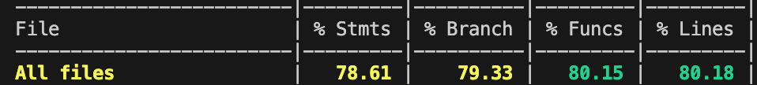

TEMPLATE FOR RETROSPECTIVE (Team 09)
=====================================

The retrospective should include _at least_ the following
sections:

- [process measures](#process-measures)
- [quality measures](#quality-measures)
- [general assessment](#assessment)

## PROCESS MEASURES 

### Macro statistics

- Number of stories committed vs done 
- Total points committed vs done 
- Nr of hours planned vs spent (as a team)

**Remember**  a story is done ONLY if it fits the Definition of Done:
 
- Unit Tests passing
- Code review completed
- Code present on VCS
- End-to-End tests performed

> Please refine your DoD 

### Detailed statistics

| Story  | # Tasks | Points | Hours est. | Hours actual |
|--------|---------|--------|------------|--------------|
| _#0_   |      22 |    -   |      72.5  |   73.25      |
| KX11   |    1    |    6   |       3.5  |      3.5     |
| KX17   |      1  |  10    |        4   |        4     |
   

> place technical tasks corresponding to story `#0` and leave out story points (not applicable in this case)

- Hours per task average, standard deviation (estimate and actual)

|            | Mean | StDev |
|------------|------|-------|
| Estimation |   3.33   |    3.06   | 
| Actual     |  3.36    |   3.12    |

- Total estimation error ratio: 0.009375
    
- Absolute relative task estimation error: 0.076
  
## QUALITY MEASURES 

- Unit Testing:
  - Total hours estimated: 4
  - Total hours spent: 5.5
  - Nr of automated unit test cases : 171
  - Coverage:
    
- E2E testing:
  - Total hours estimated: 7
  - Total hours spent: 6.6
- Code review 
  - Total hours estimated: 0
  - Total hours spent: 0
- Technical Debt management:
  - Strategy adopted: [Technical Strategy](../TD_stategy.md) 
  - Total hours estimated estimated at sprint planning: 5
  - Total hours spent: 4.6
  

## ASSESSMENT

- What caused your errors in estimation (if any)?

  - TD Management: We planned more time than needed for technical debt management as we prepared for potential complications that didn’t arise. This cautious approach ultimately helped us stay ahead.

  - E2E Testing: The task took longer due to the thoroughness of our approach, identifying more edge cases than expected. This reflects our growing attention to quality.

- What lessons did you learn (both positive and negative) in this sprint?
  - Positive:
By conducting detailed E2E testing, we were able to identify and fix errors early, improving overall product quality and boosting team confidence in our deliverables.
Our collaboration has become seamless, and we consistently align on goals during Scrum meetings, ensuring everyone is on the same page.
Completing visual and functional features, such as linked document visualization and scaling adjustments, highlighted our technical skill and attention to detail.

  - Negative:
Time estimation for testing and debugging requires further refinement, but this is a natural area of growth as we deal with increasingly complex tasks.

- Which improvement goals set in the previous retrospective were you able to achieve? 
  -  Achieved Goals:We conducted extensive E2E testing, identifying critical improvements and bugs.
Maintained consistency across tasks, particularly in terminology and diagram representations.
Strengthened our team coordination, which resulted in smoother communication and faster problem resolution.

   - Teamwork Excellence:
We effectively collaborated to ensure all tasks were completed on time while maintaining a healthy work environment.
Every team member actively contributed to discussions and task execution, ensuring no one was left behind.

  
- Which ones you were not able to achieve? Why?

  - We successfully achieved all our major goals. However, time spent on testing and debugging slightly impacted some minor tasks. This will be addressed by refining our estimation process moving forward.

- One thing you are proud of as a Team!!
  - We’re proud of our resilience and growth as a team, handling an 80-hour workload efficiently while maintaining a positive and stress-free atmosphere.
Despite being a small group of five, we’ve consistently delivered high-quality work, overcoming early challenges to become highly organized and effective.
The mutual trust and collaboration among team members have significantly improved, allowing us to tackle complex tasks and complete them with confidence.
Our ability to adapt and learn quickly has resulted in steady progress, as shown by our successful completion of both technical and visual features in this sprint.